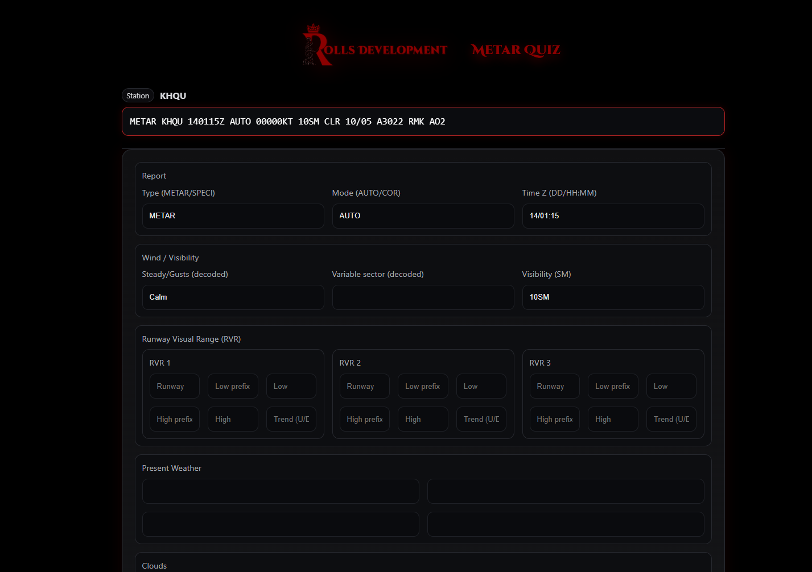
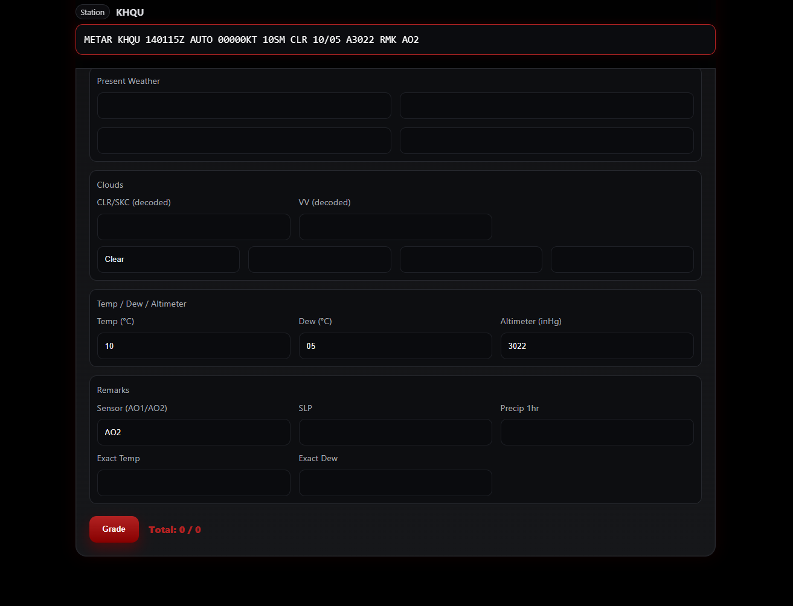
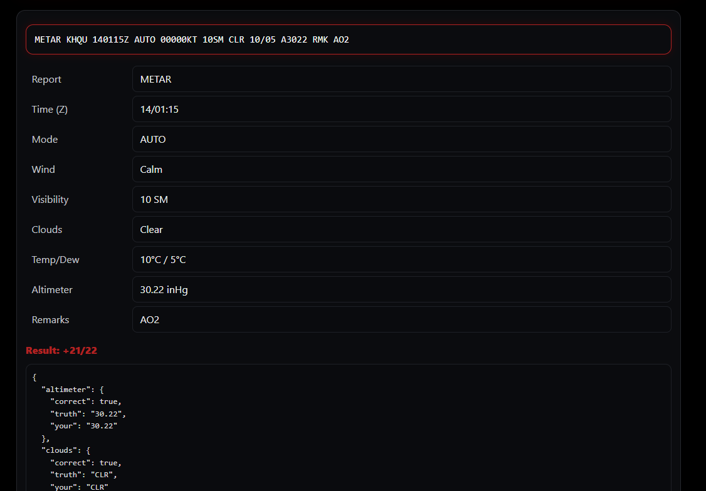

# METAR Decoder – Installer
_A Rolls Development Project_

## 📄 Overview
METAR Decoder is a lightweight, standalone Windows application designed to help pilots, students, and aviation enthusiasts practice and decode METAR weather reports quickly and accurately.

This repository contains the official **Windows Setup Installer (.exe)** for the current release.

No source code is included in this repository.  
All rights to the software are retained by **Rolls Development**.

---
## 📥 Download

Get the latest installer here:

👉 **[Download METAR Decoder (Latest Release)](https://github.com/KingOfRolls-Dev/Metar_decoder/releases/latest)**

This is the only supported download location.

## 🛠️ Installation
1. Run the installer.
2. > If SmartScreen appears, choose **More info → Run anyway**.
3. Follow the on-screen prompts.
4. Launch **METAR Decoder** via your Start Menu or desktop shortcut.

---
## 📸 Screenshots

### Main Interface

### Answers View

### Results

> Additional images are available in the [`/screenshots`](screenshots/) directory.

---

## 🔒 Security & Integrity
This software is distributed in compiled binary form only.

If your browser or Windows SmartScreen provides a warning, select:  
**“More info” → “Run anyway”**  
This is normal for unsigned educational software.

To avoid false virus flags, the installer may also be distributed inside a ZIP archive.

---

## 📘 License
This project is distributed under the **Rolls Development Software License Agreement** found above.

By downloading or installing the software, you acknowledge and accept the terms of that license.

---

## 📬 Contact
For feedback, questions, or future updates:

**Rolls Development**  
🌐💬 Join My Discord -> [Rolls Development](https://discord.gg/Zh9xttbESm)  
📧 dev.kingofrolls@gmail.com

---
